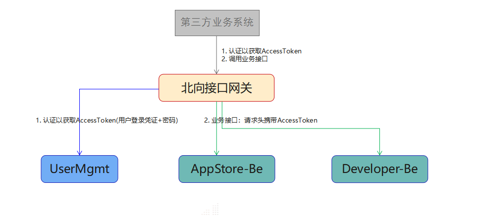

开发者指导
=================

## EdgeGallery业务开发指导

- [APPStore](../Projects/APPSTORE/AppStore_Contribution.md)

- [Developer](../Projects/Developer/Developer_Contribution.md)

- MECM
	- [APM](../Projects/MECM/MECM_Apm_Contribution.md)  
	- [APPO](../Projects/MECM/MECM_Appo_Contribution.md)  
	- [Inventory](../Projects/MECM/MECM_Inventory_Contribution.md)  
	- [APPLCM](../Projects/MECM/MECM_LCM_controller_Contribution.md)

- [MEP](../Projects/MEP/MEP_Contribution.md)

- [User Management](../Projects/User%20Management/User_Contribution.md)

- [ATP](../Projects/ATP/ATP_Contribution.md)


## 北向接口调用指导

EdgeGallery支持第三方业务系统通过北向接口网关调用EdgeGallery的业务接口。调用流程如下图所示：



### 北向接口调用endpoint

目前由WebsiteGateway来承担北向接口网关的职责，具体是由通过WebsiteGateway运行起来的各业务平台前端来承担。

所以北向接口调用的endpoint可以使用任意一个业务平台前端的endpoint。如下：

| 平台 | endpoint | 说明 |
| ------- | ---------- |-------|
| EdgeGallery融合前端 | https://{PORTAL_IP}:30095 | 推荐使用该endpoint|
| AppStore平台前端 | https://{PORTAL_IP}:30091| -- |
| Developer平台前端 | https://{PORTAL_IP}:30092| -- |
| Mecm平台前端 | https://{PORTAL_IP}:30093| -- |
| Atp平台前端 | https://{PORTAL_IP}:30094| -- |


### 获取XSRF-TOKEN

在调用获取AccessToken的接口和各平台的业务接口之前，需要先获取到XSRF-TOKEN。

```
Resource URI: /
Method: GET
```

Example request:

```
GET https://x.x.x.x:30095/
```

Example response:

```
response 200 OK

响应的Cookie中即包含XSRF-TOKEN，请获取它。
后续所有的接口调用中都需要通过请求头X-XSRF-TOKEN传递。
```

### 获取AccessToken

```
Resource URI: /mec-usermgmt/v1/accesstoken
Method: POST
```
| Name    | Definition |Type   | Required| Describe |
| ------- | ---------- |-------|---------| ---------|
| X-XSRF-TOKEN | XSRF-TOKEN | header |是| |
| userFlag | 登录凭证（用户名/邮箱/手机号） |body|是| |
| password | 密码 |body|是| |

Example request:

```
https://x.x.x.x:30095/mec-usermgmt/v1/accesstoken -H "X-XSRF-TOKEN: xxxx"
{
  "userFlag": "",
  "password": ""
}

```

Example response:

```
response 200 OK
{
  "accessToken": "eyJhbGciOiJSUzI1NiIsInR5xxxxxxxxxxxxxxxxxxxxxxxxxxxxxxxxxxxx"
}

后续所有的业务接口调用都需要通过请求头X-ACCESS-TOKEN传递这里的accessToken值。

response 400 Bad Request
{
  "code": 70xxx,
  "message": ""
}

response 401 Unauthorized
{
  "code": 70xxx,
  "message": ""
}
```

### 调用业务接口

各平台提供的业务接口，参考各模块的接口文档。

#### 北向业务接口URL格式

通过北向接口调用各平台的业务接口时，URL按照如下格式调用：

```
https://x.x.x.x:30095/{urlPrefix}/{业务接口自身的URL}
```

其中urlPrefix是各平台在网关中定义的路由前缀，定义如下表所示：

| 平台    | urlPrefix |
| ------- | ---------- |
| AppStore | mec-appstore |
| Developer | mec-developer |
| Mecm-Inventory | mecm-inventory |
| Mecm-APPO| mecm-appo |
| Mecm-APM | mecm-apm |
| ATP | mec-atp |

#### 北向业务接口请求头

通过北向接口调用各平台的业务接口时，需要传递如下请求头：

| Name    | Definition |
| ------- | ---------- |
| X-XSRF-TOKEN | XSRF-TOKEN |
| X-ACCESS-TOKEN | ACCESS-TOKEN |


#### 北向业务接口调用示例

AppStore平台提供了获取应用列表的接口：
GET /mec/appstore/v1/apps

北向调用：

```
GET https://x.x.x.x:30095/mec-appstore/mec/appstore/v1/apps -H "X-XSRF-TOKEN: xxxx" -H "X-ACCESS-TOKEN: xxxx"
```
